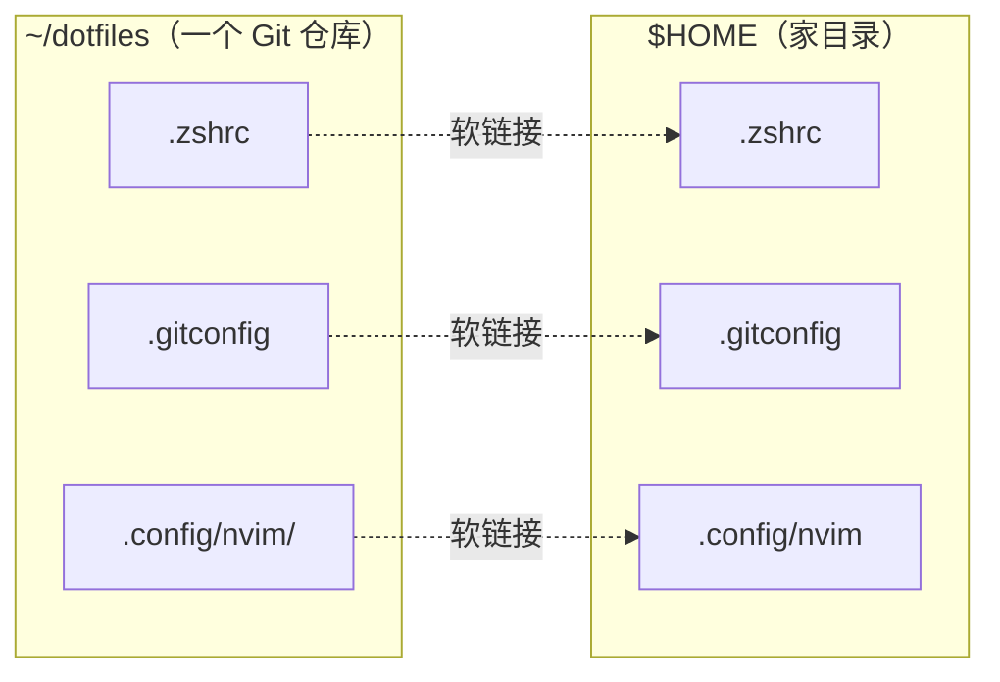

[环境搭建](/blog/dev-environment-from-zero/) 那篇里你装好了终端、运行时和编辑器。
这篇解决它留下的问题：**这些配置全在你自己电脑上，换一台机器就从零开始。**

配置也该有版本历史：改坏了能回退，换了机器能一键还原，同学之间能直接抄一份。
这些文件在 Unix 里大多以 `.` 开头（`.bashrc`、`.gitconfig`），所以叫 dotfiles。

## 先分清两件事：配置和密钥

放进仓库的东西，默认都是**公开**的（除非你特意建私有仓库）。所以第一步是分类：

| 类型 | 例子 | 处理方式 |
| --- | --- | --- |
| 配置 | `.bashrc`、`.gitconfig`、`.vimrc`、`~/.config/nvim/` | 进仓库 |
| 工具版本 | `.nvmrc`、`.python-version`、`asdf` 的版本文件 | 进仓库 |
| 密钥 | SSH 私钥、`~/.aws/credentials`、API token、`.npmrc` 里的 token | **永不进仓库** |
| 机器相关 | 写死了公司内网地址的变量、本地路径 | 拆出来，用 include 引入 |

密钥这条不是「注意一下就行」，是硬规则。**已经提交过的 token，改掉 `.gitignore` 也没用**——
历史里还在，克隆的人都能看到。真提交了，只能：立刻去平台吊销它 → 重新签发 → 再清理历史
（`git filter-repo`）。顺序不能反，先吊销才安全。

## 怎么组织：一个目录 + 软链接

三种常见做法，选第二种：

| 做法 | 说明 | 结论 |
| --- | --- | --- |
| 直接在 `$HOME` 里 `git init` | 家目录就是工作区 | 别用。`git add .` 会把缓存、下载、密钥一起卷进去 |
| `~/dotfiles` + 软链接 | 真文件在仓库里，家目录放链接 | 本篇用的方式，好读好查 |
| `stow` 之类的工具 | 自动建链接，规则藏在工具里 | 文件多了再考虑，现在没必要 |

软链接（symlink）的意思是：`~/.zshrc` 不存内容，它只是指向 `~/dotfiles/zshrc` 的一条捷径。
编辑任意一边，另一边同时变。

家目录里的每个点文件都只是一条捷径，真正的内容都在仓库里：



## 第一步：建仓库并搬文件

**用 `git mv` 而不是 `mv`**，这样移动记录在 Git 里，历史不会断：

```bash
mkdir -p ~/dotfiles && cd ~/dotfiles
git init

# 先把最常见、最安全的三样搬过来（文件名前的点去掉，仓库里更好读）
git mv ~/.bashrc       ./bashrc
git mv ~/.zshrc        ./zshrc
git mv ~/.gitconfig    ./gitconfig
```

编辑器配置是一个**目录**，一起搬：

```bash
# 注意：目录要先存在，mv 的路径才写得对
mkdir -p ./.config/nvim
git mv ~/.config/nvim/init.lua ./.config/nvim/init.lua
```

搬完先别提交，看一眼状态，确认没有意外文件混进来：

```bash
git status
```

## 第二步：写一个安装脚本

这一步是整篇的核心。目标：**在新机器上跑一次，所有软链接就位**。

```bash
#!/usr/bin/env bash
# install.sh — 把 dotfiles 链接到家目录。
# 有则覆盖（-f），已经是对的链接也不报错，可以反复运行。
set -euo pipefail

DOTFILES="$(cd "$(dirname "${BASH_SOURCE[0]}")" && pwd)"

link() {
  local rel="$1"          # 仓库里的相对路径，如 zshrc
  local target="$HOME/$rel"
  mkdir -p "$(dirname "$target")"
  ln -sfn "$DOTFILES/$rel" "$target"
  echo "linked $target"
}

link bashrc
link zshrc
link gitconfig
link .config/nvim/init.lua
```

两个细节值得说明：

- `set -euo pipefail`：任何一个命令失败就停下，变量名写错也直接报错。
  写脚本时几乎总该加上，否则失败会被静默忽略。
- `ln -sfn`：`-s` 建软链接，`-f` 目标已存在就替换，`-n` 当目标是**目录**时不要钻进去建子链接。
  `-n` 是这里最容易漏的一个参数。

```bash
chmod +x install.sh
./install.sh
```

## 第三步：让机器相关的配置能插进来

`.gitconfig` 里有你的名字和邮箱，但可能也有公司目录、私有镜像地址——那些不该进公开仓库。
解决办法是留一个**本地文件**的口子：

```ini
# gitconfig（仓库里的这份）
[user]
    name = your-name
    email = you@example.com
[core]
    editor = nvim

# 如果本地有这个文件，就把它的内容并进来
[include]
    path = ~/.gitconfig.local
```

```bash
# 这台机器独有的东西写这里，它不进仓库
cat >> ~/.gitconfig.local <<'EOF'
[url "git@company-git.example.com:"]
    insteadOf = https://github.com/company/
EOF
```

`.gitignore` 里再加一层保险：

```text
*.local
*.secret
.env
```

## 第四步：推到远程

```bash
cd ~/dotfiles
git add .
git commit -m "dotfiles 第一版：shell、git、nvim"

# 私有仓库对 dotfiles 更合适：私有库同样免费，密钥之外的东西也不怕被人翻
git remote add origin git@github.com:<你的用户名>/dotfiles.git
git branch -M main
git push -u origin main
```

## 常见坑

### 链接错了，家目录多了个不存在的文件

`ln -s` 不会检查源文件是否存在，打错字也能建出「指向空气」的链接。
之后运行会报 `No such file or directory`，但文件明明"在"。

```bash
# 看一眼链接指向哪里，红色的就是断链
ls -l ~/.zshrc
```

### 把 `~` 写死进了配置文件

配置文件里尽量用 `$HOME` 或相对路径，别写 `/home/你的名字/...`。
不然换台机器、换个用户名，全部失效——而链接看起来是好的。

### 装脚本覆盖了已有文件

第一次跑 `install.sh` 前，确认家目录里那些同名文件已经搬进仓库了。
`ln -sfn` 会**直接覆盖**，不问你。已经改乱了就用 `git status` 找回仓库里的那份。

## 下一步

这套东西跑通之后，装新机器的流程就变成四行：

```bash
git clone git@github.com:<你的用户名>/dotfiles.git ~/dotfiles
cd ~/dotfiles && ./install.sh
# 再补上本地专用的 ~/.gitconfig.local
```

再往下是这个方向的贯通层题目：把包清单也管起来（`brew bundle`、
`pacman -Qqe`、`apt-mark showmanual`），让「半小时恢复到能干活」变成一条命令。
想写就 [开一个 issue 认领](/tracks/env/)。
