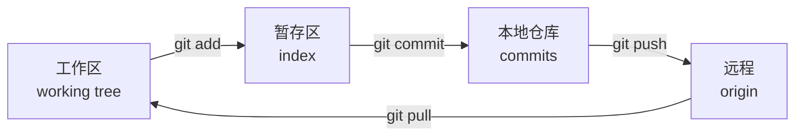

Git 难，多半是因为没搞清它在存什么。命令可查；模型错了会一直用错。
下面先讲三句模型，再给日常够用的十个命令。

## 核心模型：三句话

1. **提交（commit）是快照，不是差异。** 每次提交记录的是「那一刻整个项目的状态」，差异是算出来的。
2. **分支（branch）只是一个指针。** 它指向某个提交，本身几乎不占空间，所以随便开。
3. **远程（remote）是另一份完整仓库。** `push` / `pull` 是两份仓库之间同步，不是「上传文件」。

理解了这三句，下面这些问题的答案就自然出来了：

- 为什么开分支这么快？——因为只是写了一个指针。
- 为什么切换分支工作区会变？——因为 Git 把工作区重建成那个快照。
- 为什么能不联网提交？——因为本地就是完整仓库。

## 只记这五个概念

这四个位置之间只有四个动作，顺序记错就会出现「我提交了但远程没有」：



暂存区是最容易被忽略的一层：它让你决定「这次提交包含哪些改动」。
`git add -p` 可以逐个改动块确认，写出来的提交会干净很多。

```bash
mkdir learn-git && cd learn-git
git init

# 第一份快照
echo "# 我的笔记" > README.md
git add README.md
git commit -m "初始化仓库"
```

## 日常够用的十个命令

| 场景 | 命令 |
| --- | --- |
| 看当前状态 | `git status` |
| 看未暂存的改动 | `git diff` |
| 挑着暂存 | `git add -p` |
| 提交 | `git commit -m "..."` |
| 看历史（一行一条） | `git log --oneline --graph --decorate` |
| 开分支并切过去 | `git switch -c feat/notes` |
| 推上去并建立追踪 | `git push -u origin feat/notes` |
| 拉取并变基 | `git pull --rebase` |
| 临时存一下 | `git stash` / `git stash pop` |
| 撤销工作区改动 | `git restore <file>` |

新手最该养成的习惯：**提交前先 `git status` 和 `git diff`**。看一眼自己到底要提交什么，
能避免八成的「啊我提交了密码」。

## 提交信息怎么写

一句能读懂的话，比格式规范有用得多：

```text
好：修复 WSL 下 pip 找不到命令的问题
好：为链表笔记补充删除节点的图示
差：update
差：改了一下
```

如果改动大，写「做了什么 + 为什么这么做」两段，第二段比第一段值钱。

## 冲突是什么

冲突不是错误，是两个人都改了同一个地方，Git 让你来决定用哪个：

```text
<<<<<<< HEAD
pip3 install --user requests
=======
python3 -m pip install --user requests
>>>>>>> feat/env
```

处理方式只有三步：

1. 打开文件，把 `<<<<<<<`、`=======`、`>>>>>>>` 三行删掉
2. 挑一个版本，或者把两者合成一句更合适的
3. `git add <file>` 然后 `git commit`

> 记住：冲突标记本身就是要你删掉的东西。留着它提交，代码就跑不起来了。

## GitHub 上发生了什么

可以把 GitHub 理解成「带网页界面的 Git 托管服务」：仓库内容还是 Git，多了 issue、PR、Actions。

最常见的协作流程（也是开源项目的标准流程）：

```bash
# 1. Fork 之后克隆自己的那份
git clone git@github.com:<你的用户名>/XJTUCSLG.github.io.git
cd XJTUCSLG.github.io

# 2. 关联上游，方便同步
git remote add upstream https://github.com/XJTUCSLG/XJTUCSLG.github.io.git

# 3. 开分支干活
git switch -c fix/typo-in-git-post

# 4. 提交并推送到自己的仓库
git add -p
git commit -m "修正 Git 笔记中的命令示例"
git push -u origin fix/typo-in-git-post
```

然后在网页上发 Pull Request。PR 被合并后：

```bash
git switch main
git pull --rebase upstream main
git push origin main
```

## 什么时候用 merge，什么时候用 rebase

| 情况 | 建议 |
| --- | --- |
| 更新自己的分支 | `git pull --rebase`，历史成一条线 |
| 合并到主干（团队仓库） | merge，保留「这是一个功能」的结构 |
| 别人已经基于你的提交工作 | 别 rebase，会改写别人的历史 |

一句话原则：**你一个人的分支随便 rebase，别人用过的历史不要动。**

## 搞砸了怎么办

```bash
# 改坏了但还没提交
git restore .

# 提交了但信息写错（还没推送）
git commit --amend -m "新的提交信息"

# 想知道「我刚干了什么」，看所有操作记录
git reflog
```

`git reflog` 是后悔药：即使分支被删了，只要操作过，通常还能找回来。
它记录的是 HEAD 的移动历史，跟 `log` 不是一回事。

## 下一步

这一篇讲的是模型。命令用起来之后的那些事——rebase 冲突、cherry-pick、找回被删的分支——
在同一个方向的「实践」层里写。先去读 [第一个开源 PR](/blog/first-open-source-pr/)，
把那套模型用在一次真实的提交上。
