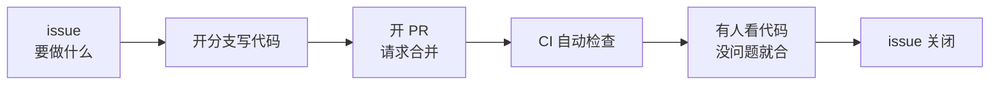

上篇说到 GitHub 是放在网上的仓库。这篇解决下一个问题：写代码从一个人变成一群人，靠脑子记就不够了。谁在做什么？做到哪了？他改的代码能不能合进来？这三件事，就是 issue、PR、CI 各自要解决的。

## 为什么需要：一个人和一群人的区别

一个人写代码，"要做什么"记在脑子里就行。功能做完了，自己看一眼，合了。

一群人就不行了，三个问题冒出来：谁在做什么，做到哪了，靠吼靠问很快就乱；他写完的代码能不能合进主分支，直接合坏代码就进去了；每次合并前都人肉检查一遍，又累又会漏。

所以需要三个东西：一个记事的地方，一个"合进来之前先看看"的流程，一个自动跑检查的机器。对应过来就是 issue、PR、CI。

## 它们在流程里的位置



比如这样走一遍。有人在 issue 里记了一条"登录页验证码不显示"，你领了，开个分支修好，push 上去，开个 PR 说"我改完了，合进来吧"。CI 自动跑测试，通过了。维护者看了一遍代码，没问题，点合并，issue 自动关闭。

先有 issue 记录要做什么，才有 PR 请求合并；PR 开了，CI 才有东西可查。三件套得串起来看。

## 具体用法和时机

**issue：什么时候开？发现 bug、有新需求、拿不准要不要做的时候。**标题一句话说什么事，正文讲背景或复现步骤，贴上报错截图更好。

**PR：什么时候开？功能写完、想合进主分支的时候。**PR 里写清楚改了什么，为什么这么改，自己是怎么测的。标题写人话，"修复登录页验证码不显示"比"fix"强。

```bash
git switch -c fix/captcha      # 开个分支，在分支上改
# ... 改代码，commit ...
git push -u origin fix/captcha  # 推上去
# 然后去 GitHub 网页上点 "Compare & pull request"
```

**CI：什么时候跑？每次 push 自动跑，不用你管。**挂了就点进日志看哪一步红了，本地修好再 push，它会重新跑。CI 拦的是坏代码，挂了别慌。

> 新手常问：小改动也要开 PR 吗？看仓库规矩。自己的小项目直接合没问题；别人的项目、人多的项目，走 PR 是基本礼仪。

## 下一步

理论走完了，去 [第一个开源 PR](/blog/first-open-source-pr/) 走一遍真实的流程：从领 issue 到 PR 被合并。合代码之前想把提交整理干净，看 git 实践篇《rebase、cherry-pick 与各种后悔药》。
